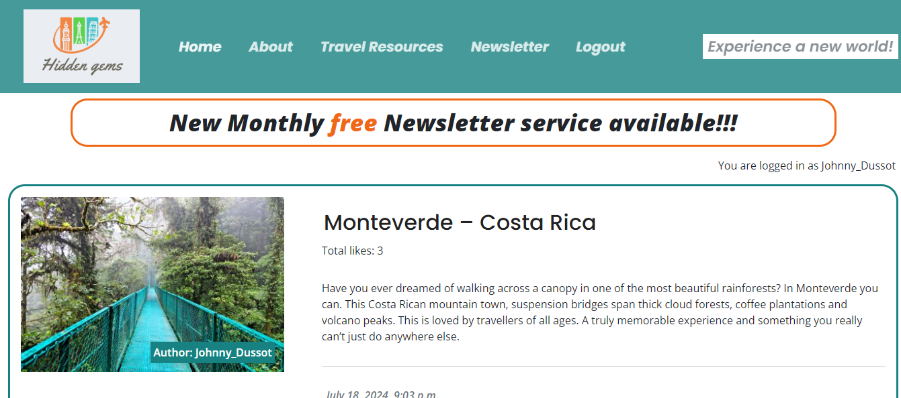
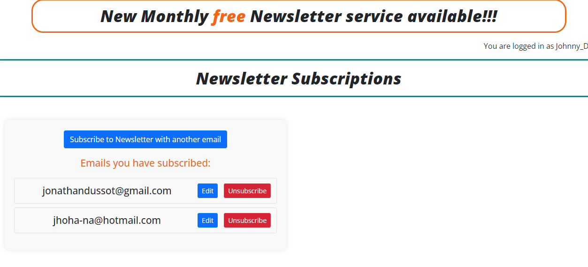

# Hidden Gems
Hidden Gems is a special infomative blog on hidden, underrated yet somewhat known locations which avid travelers may be keen to read up on, share with others or even travel to.  It offers users a monthly newsletter to stay updated on the latest discoveries, as well as the chance to collaborate.


The live link for "Hidden Gems" can be found [HERE](https://hidden-gem-blog-d08378ae9ea1.herokuapp.com/)

## Table of Contents
+ [UX](#ux "UX")
  + [Site Purpose](#site-purpose "Site Purpose")
  + [Site Goal](#site-goal "Site Goal")
  + [Audience](#audience "Audience")
  + [Communication](#communication "Communication")
  + [Existing User Goals](#existing-user-goals "Existing User Goals")
  + [New User Goals](#new-user-goals "New User Goals")
+ [User Stories](#user-stories "User Stories")
  + [Admin stories](#admin-stories "Admin stories")
  + [Site User stories](#site-user-stories "Site User stories")
+ [Design](#design "Design")
  + [Colour Scheme](#colour-scheme "Colour Scheme")
  + [Typography](#typography "Typography")
  + [Imagery](#imagery "Imagery")
+ [Features](#features "Features")
  + [Existing Features](#existing-features "Existing Features")
  + [C.R.U.D](#crud "C.R.U.D")
+ [Testing](#testing "Testing")
  + [Validator Testing](#validator-testing "Validator Testing")
  + [Unfixed Bugs](#unfixed-bugs "Unfixed Bugs")
+ [Technologies Used](#technologies-used "Technologies Used")
  + [Main Languages Used](#main-languages-used "Main Languages Used")
  + [Frameworks, Libraries & Programs Used](#frameworks-libraries-programs-used "Frameworks, Libraries & Programs Used")
+ [Deployment](#deployment "Deployment")
+ [Credits](#credits "Credits")
  + [Content](#content "Content")
  + [Media](#media "Media")

## UX

### Site Purpose:
The aim of ths site is to bring together people from various walks of life with pictures of wonderful locations around the world. [“Hidden Gems”](https://hidden-gem-blog-d08378ae9ea1.herokuapp.com/) is a blog with a variety of beautiful locations around the world which visitors to the site can look up and appreciate, some maybe even with the purpose of traveling to one of these based on the information provided.  Registered site users can sign up to a monthly newsletter with the latest locations posted.  They can also like posts and comment, giving them the possibility of interacting together based on their own experiences.

### Site Goal:
To create a community where various users can participate in sharing some of the most beautiful locations around the globe. We're also set on it being estalished as a top-quality comfort zone for travelers, whether traveling alone or as a family, so they can comfortably share and rely on experiences and tips given, such as the resources available.

### Audience:
Practically anybody with an interest in gorgeous landscapes since it makes for an excellent informative site on places to travel to and what to see.  Some may also be keen travelers who travel frequently.  Also, it's ideal for someone just seeking advice on what services to use abroad.

### Communication:
users are provided with user-friendly features to get in contact with site owner or other potential bloggers/users within the posts.

### Existing User Goals:
The capability of viewing, commenting on, and sharing experiences constantly within the community of travelers registered. Also, the potential to create collaborations to either facilitate a trip or support in other ways.

### New User Goals:
To feel welcomed by several posts on beautiful imagery and scenery to be discovered throughout the website.

### Future Goals:
- To provide users with a GPS location of the location and it's proximite surroundings that can be taken advantage of.
- Users and admin on the posts would be able to optionally provide specific recommendations in terms of hotel accomodations, or have the site provide default options based on the GPS location's proximity.
- The option for other bloggers to create their own posts to be approved and shared among the community as opposed to just the site admin's travels & posts.
- The ability to send out the monthly newsletter to subscribed user's emails with the newest experiences and possibly a contest with the chance to win a prize or souvenir.
- A structure within the website to help users plan their flights and have a rough estimate of a necessary budget, which could eventually lead to a flight-purchasing website such as skyscanner. 

## User Stories
Not all stories have been implemented. Some have been left for future implementations as the site grows and expands.

### Admin stories:
#### As an admin:
1. I can **create, read, update and delete posts** so that **I can manage my blog content**.
 - Story points: 4
2. I can **enter the subscription section** so that **I can see a list of subscribed emails**.
 - Story points: 2
3. I can **create and update the About page content** so that **it is available to view on the site.**.
 - Story points: 1
4. I can **create draft posts** so that **I can finish writing the content later.**.
 - Story points: 2
5. I can **approve or disapprove comments** so that **I can filter out objectionable comments.**.
 - Story points: 2
6. I can **store collaboration requests** so that **I can read submitted forms.**.
 - Story points: 2

### Site User stories:
#### As a site user:
1. I can **leave comments on a post** so that **I can be involved in the conversation.**.
 - Story points: 3
2. I can **click on the Travel Resources section** so that **I can view the information provided**.
 - Story points: 1
3. I can **modify or delete my comment on a post** so that **I can be involved in the conversation**.
 - Story points: 2
4. I can **post a message to the Site Admin with my details** so that **I can propose an idea for collaboration.**.
 - Story points: 2
5. I can **register an account** so that **I can comment on a post.**.
 - Story points: 3
6. I can **view comments on an individual post** so that **I can read the conversation.**.
 - Story points: 2
7. I can **can click on the about link** so that **I can read information about the site and site admin.**.
 - Story points: 1
8. I can **click on a post** so that **I can read the full text.**.
 - Story points: 1
9. I can **view a paginated list of posts** so that **I can select which post I want to view.**.
 - Story points: 3
10. I can **enter my email** so that **I am subscribed to the newsletter service.**.
 - Story points: 3
11. I can **update my email** so that **I am subscribed to the newsletter service with the correct email address.**.
 - Story points: 4
12. I can **delete my email** so that **I am unsubscribed to the newsletter service.**.
 - Story points: 4

## Design

### Wireframes:

#### Home Page: 


#### Post Details Page:


#### About Page:


#### Resources Page:


#### Newsletter Page:


### Database Schema


### Colour Scheme:


### Typography:
All fonts were obtained from the Google Fonts library. I chose the following fonts for the page:
1. Kanit: Site heading/logo, Blog & print titles
2. Permanent Marker: site navigation & site buttons
3. Shadows Into Light Two: all remaining site text

### Imagery:
- All photography for the fictional "artists" was supplied by me.
- Two drawings have also been uploaded, with the consent of the artist. They have been named in the Credits section.

## Features

### Existing Features:

#### Home Page:



#### Navigation Bar:

##### Desktop:


##### Mobile:


#### Paginated features:
- Leads user to next/ previous page(s) assuming there's more posts than the page's limit.


#### About Page:


#### Collaboration Form on About Page:


#### Travel Resources Page:


#### Post Details Page:


#### Like button feature:


#### Post Details Comment Section:


#### Log in, Log out & Sign up:

##### Login:


##### Logout:


##### Sign-up:


#### Footer:


### C.R.U.D:

#### Newsletter Subscription Page - Create:
- This gives users the option to sign up for the newsletter by entering their email before being alerted on the success of their subsription.
- It is only visible to users who are signed in.


#### Newsletter Subscription Page - Read:
- User is alerted as to the successful subsription...

- ...before being led to the email-list page with a display of the email(s) they have subscribed on their account alone.


#### Newsletter Subscription Page - Update:
- The user is given the option to edit the email address on their account alone.


#### Newsletter Subscription Page - Delete:
- The user is given the option to delete an email(s) and unscubscribe on their account alone.


### Features Left to Implement
- System to send out newsletters.
- newsletter contests.
- flight reservation section.
- GPS map showing location.
- Hotels/ Other accomodation around the location using GPS.
- Password reset.
- Social media sign-in.

## Testing

### Validator Testing
| **TEST** | **ACTION** | **EXPECTATION** | **RESULT** |
| ----------------------------- | ----------------------- | --------------------------- | ---------- |
| gems - settings.py | PEP8 validator | [No issues found](static/images-readme/pep8-validator-python.png) | ✅ |
| gems - urls.py | PEP8 validator | No issues found | ✅ |
| blog app - forms.py | PEP8 validator | No issues found | ✅ |
| blog app - models.py | PEP8 validator | No issues found | ✅ |
| blog app - views.py | PEP8 validator | No issues found | ✅ |
| blog app - urls.py | PEP8 validator | No issues found | ✅ |
| blog app - admin.py | PEP8 validator | No issues found | ✅ |
| about app - forms.py | PEP8 validator | No issues found | ✅ |
| about app - models.py | PEP8 validator | No issues found | ✅ |
| about app - views.py | PEP8 validator | No issues found | ✅ |
| about app - urls.py | PEP8 validator | No issues found | ✅ |
| about app - admin.py | PEP8 validator | No issues found | ✅ |
| newsletter app - forms.py | PEP8 validator | No issues found | ✅ |
| newsletter app - models.py | PEP8 validator | No issues found | ✅ |
| newsletter app - views.py | PEP8 validator | No issues found | ✅ |
| newsletter app - urls.py | PEP8 validator | No issues found | ✅ |
| newsletter app - admin.py | PEP8 validator | No issues found | ✅ |
| resources app - forms.py | PEP8 validator | No issues found | ✅ |
| resources app - models.py | PEP8 validator | No issues found | ✅ |
| resources app - views.py | PEP8 validator | No issues found | ✅ |
| resources app - urls.py | PEP8 validator | No issues found | ✅ |
| resources app - admin.py | PEP8 validator | No issues found | ✅ |
| style.css | [W3C - Jigsaw](https://jigsaw.w3.org/css-validator/) validator | [No issues found](static/images-readme/w3c-validator-css.png) | ✅ |
| Home page - html | [W3C](https://validator.w3.org/) validator - source code | [No issues found](static/images-readme/w3c-validator-html.png) | ✅ |
| About page - html | W3C validator - source code | No issues found | ✅ |
| Post Details page - html | W3C validator - source code | No issues found | ✅ |
| Resources page - html | W3C validator - source code | No issues found | ✅ |
| Newsletter page - html | W3C validator - source code | No issues found | ✅ |
| Sign-in page - html | W3C validator - source code | No issues found | ✅ |
| Home page - html | lighthouse | [Acceptable scores](static/images-readme/lighthouse.png) | ✅ |
| About page - html | lighthouse | Acceptable scores | ✅ |
| Post-Details page - html | lighthouse | Acceptable scores | ✅ |
| Resources page - html | lighthouse | Acceptable scores | ✅ |
| Newsletter page - html | lighthouse | Acceptable scores | ✅ |
| Sign-in page - html | lighthouse | Acceptable scores | ✅ |
| WAVE results | WAVE | [Acceptable scores](static/images-readme/wave.png) | ✅ |
| Microsoft Edge browser | Launch site | Site opens without issue | ✅ |
| Google Chrome browser | Launch site | Site opens without issue | ✅ |

### Responsiveness testing

| **TEST**                      | **ACTION**              | **EXPECTATION**             | **RESULT** |
| ----------------------------- | ----------------------- | --------------------------- | ---------- |
| Home page - responsiveness    | Size site down to 320px | all elements stay on screen | ✅         |
| Home page - responsiveness    | Size site up to 1920px  | all elements stay on screen | ✅         |
| About page - responsiveness   | Size site down to 320px | all elements stay on screen | ✅         |
| About page - responsiveness   | Size site up to 1920px  | all elements stay on screen | ✅         |
| Post-Details page - responsiveness  | Size site down to 320px | all elements stay on screen | ✅         |
| Post-Details page - responsiveness  | Size site up to 1920px  | all elements stay on screen | ✅         |
| Resources page - responsiveness    | Size site down to 320px | all elements stay on screen | ✅         |
| Resources page - responsiveness    | Size site up to 1920px  | all elements stay on screen | ✅         |
| Newsletter page - responsiveness   | Size site up to 1920px  | all elements stay on screen | ✅         |
| Newsletter page - responsiveness   | Size site up to 1920px  | all elements stay on screen | ✅         |
| Sign-in page - responsiveness | Size site down to 320px | all elements stay on screen | ✅         |
| Sign-in page - responsiveness | Size site up to 1920px  | all elements stay on screen | ✅         |

### C.R.U.D. testing

| **TEST**          | **ACTION**             | **EXPECTATION**          | **RESULT** |
| ----------------- | ---------------------- | ------------------------ | ---------- |
| Newsletter subscription - Create     | Add new instance to DB | Instance created         | ✅         |
| Newsletter subscription - Read       | Retrieve all instances | Instances visible in UI  | ✅         |
| Newsletter subscription - Update     | Modify an instance     | Mods saved & visible     | ✅         |
| Newsletter subscription - Delete     | Delete an instance     | Instance removed from UI | ✅         |
| Comments - Create | Add new instance to DB | Instance created         | ✅         |
| Comments - Read   | Retrieve all instances | Instances visible in UI  | ✅         |
| Comments - Update | Add new instance to DB | Mods saved & visible     | ✅         |
| Comments - Delete   | Retrieve all instances | Instance removed from UI | ✅         |
| Like - Create | Add new instance to DB | Instance created         | ✅         |
| Like - Delete | Delete an instance     | Instance removed from UI | ✅         |

### FEATURES

| **TEST**                      | **ACTION**             | **EXPECTATION**                                           | **RESULT** |
| ----------------------------- | ---------------------- | --------------------------------------------------------- | ---------- |
| Navigation bar                | Click on nav link      | user routed to correct page                               | ✅         |
| Footer links                  | Click on footer links  | user routed to new browser tab                            | ✅         |
| Like button                   | Click "like"           | Post liked/unliked accordingly                            | ✅         |
| Comment section                   | Written empty message           | does not submit, prompts to write a message                            | ✅         |
| Comment section                   | Write message and submit           | user informed on pending approval                            | ✅         |
| Edit button                   | Click edit button      | user allowed to edit comment only if previously approved                             | ✅         |
| Delete button                 | Click delete button    | user allowed to delete comment only if previously approved                                | ✅         |
| Collaboration form                | Submit form    | user alerted on successful form                                | ✅         |
| External links in Resources                | Click link             | User routed to appropriate webpage                           | ✅         |
| Subscription                | enter invalid email             | User prompted to write a valid email                           | ✅         |
| Subscription CRUD buttons                | Click buttons            | User routed to appropriate page and UI updated                    | ✅         |
| Login                         | User logs in           | UI updates & user is logged in                            | ✅         |
| Sign up                       | User signs up          | new account created for the user                          | ✅         |
| Logout                        | User clicks logout     | UI updates, user is logged out, user cannot create a post | ✅         |

### BUG TESTING:
1. index.html page not loading:
 - Through trial and error, I changed the view code from a class to a function.
 - as well as removed the ```.as_view()``` from the URL path.

2. CSS styles not loading on blog page:
 - This [Django tutorial](https://docs.djangoproject.com/en/4.0/intro/tutorial06/) indicated that the styles were incorrectly linked.
 - This was resolved updating the href link in the base.html to ``````

3. Error message after installing Allauth:
 - Tutor support informed me that Heroku had updated my database url value.
 - This was resolved by updating the env.py file with the new URL.

4. Invalid "syntax" error after installing **crispy-forms**:
 - A comma was missing from within the BlogPostPage class.

5. Django error message after adding comment form:
 - CSRF token had been added as CRSF.
 - Correcting the error resolved the issue.

6. Console error after adding "Categories" field to Artprints model:
 - The console indicated that a default field had not been supplied.
 - As I did not remember that it would need to be an integer, I added ```default='undecided'``` to the field.
 - This produced further error messages.
 - I corrected the model, and attempted to migrate the changes once more. The same error continued to display on the console.
 - I looked up how to revert the migrations on [Stackoverflow](https://stackoverflow.com/questions/32123477/how-to-revert-the-last-migration) using the following command: ```./manage.py migrate artprints zero```, but this did not resolve the issue.
 - After consulting with a fellow student who had experienced something similar, [Mats Simonsson](https://github.com/Pelikantapeten), I then deleted the files out of the migrations folder within my app folder.
 - This resolved this issue.
 - However upon contemplation, I have understood that had the database been significantly populated with data, this would not be a reasonable approach to take, as it would eliminate important information.

7. URL paths for second app:
 - Being unable to submit an empty string as the first parameter in the main URLs folder, my weblink was displaying as **prints/prints/**.
 - Having tried multiple suggestions from numerous sources, I instead resorted to changing the main URL path to **art** so that any new URL path created in the second app file, would then display as **art/pathname**
 - This is not the resolution that I was looking for, however for aesthetics, I have accepted it as the solution for now.

8. Hero & About image not loading on deployed site:
 - These two images were stored directly within the django app as opposed to being uploaded to Cloudinary.
 - I tried numerous articles that suggested to change the URL path linked in the CSS file, and tried the following:
  - ```background: url(/static/images/gallery-wall.jpg) no-repeat;``` : As shown in [Simpleit](https://simpleit.rocks/python/django/call-static-templatetag-for-background-image-in-css/)
  - ```background: url('') no-repeat;``` : As showing in [Stackoverflow](https://stackoverflow.com/questions/5898776/how-to-refer-to-static-files-in-my-css-files)
  - ```background: url('') no-repeat;```
  - ```background: url("{{ STATIC_URL }}images/gallery-wall.jpg") no-repeat;```
  - ```background: url(static("images/gallery-wall.jpg"));```
 - As none of these resolved the issue, and I was unable to ascertain the solution that I required, I instead resorted to loading the images directly into the HTML files as opposed to the CSS. 
 - Issue resolved.

9. Art submission form unable to complete:
 - Terminal error suggested no file was selected.
 - I read numerous articles on stackoverflow, cloudinary, comments on slack, and was unable to resolve this.
 - Ger from Tutor support indicated that the required field was missing from my form tags ```enctype="multipart/form-data```
 - Adding this resolved the issue.

10. User unable to submit multiple prints:
 - This was due to the slug field not being included in the form submission.
 - Another side effect of this, is that when the print was then approved via the admin panel, should the admin not pay attention and approve it without inserting a slug, the entire prints page would then fail to load.
 - To resolve this, the slug field was added to the form field.
 - Have not yet figured out how to have this auto-populate as it would were it submitted directly from the admin panel.
 - However, adding the slug field ensures that the "Create" feature of CRUD now works as intended.

11. Blog post page pushes social links to left:
 - Upon inspection in dev tools, the row containing the comments was being duplicated, causing the layout to shift.
 - Issue resolved by moving the `````` inside of the closing div for the row.
 - This then caused an issue with the view when the user was logged out.
 - Once more, the opening & closing if statements needed to be moved outside the row entirely.

12. Submit multiple comments:
- Due to how the comments section was set up in the html file, upon submission of a comment, regardless of approval, the form would no longer be available to the user. Instead, a display message was constantly shown, suggesting that the comment was still pending approval, even if it had been approved.
- To resolve this, the section in the HTML was removed, and instead a line was added to the view function so that a success message would display on the screen after submission. This then allows the user to go and submit multiple comments on the same post, regardless of whether they have an approved or pending comment already submitted.

13. Testing CRUD functionality:
 - Each of the features were tested multiple times to ensure that numerous new posts could be submitted, and that each post had the ability to be updated and edited by the user that submitted it.
 - If a post is submitted by another user, the edit/delete buttons do not appear on the page.

14. Forms test failed to run:
 - When running the newly created test in forms.py, the following error occurred in the terminal: "Got an error creating the test database: permission denied to create database".
 - A [Slack comment](https://code-institute-room.slack.com/archives/C026PTF46F5/p1647428298841409?thread_ts=1647427231.501879&cid=C026PTF46F5) provided the answer for this, & suggested that the new DATABASES variable in the settings.py file needed to be commented out, and the original one to be made active again for the tests to work.
 - Following these steps allowed the test to perform as expected.

15. AssertionError: 301 != 200:
 - The second test implemented from the "Hello Django" project failed each time it was ran.
 - The answer on how to resolve it was ascertained from [Stackoverflow](https://stackoverflow.com/questions/21215035/django-test-always-returning-301), and adding an ```follow=True``` to the code in turn caused the tests to pass.

### Unfixed Bugs
- None that I'm aware of

## Technologies Used
### Main Languages Used
- HTML5
- CSS3
- Javascript
- Python
- Django
- SQL - Postgres

### Frameworks, Libraries & Programs Used
- Google Fonts - for the font families: 
- Font Awesome - to add icons to the social links in the footer element.
- GitPod - to create my html files & styling sheet before pushing the project to Github.
- GitHub - to store my repository for submission.
- Balsamiq - were used to create mockups of the project prior to starting.
- Am I Responsive? - to ensure the project looked good across all devices.
- Favicon - to provide the code & image for the icon in the tab bar.
- Adobe Photoshop - for photo editing
- Django
- Bootstrap
- DrawSQL

### Installed Packages:
- 'django<4' gunicorn
- dj_database_url psycopg2
- dj3-cloudinary-storage
- django-summernote [(link)](https://summernote.org/)
- django-allauth [(link)](https://django-allauth.readthedocs.io/en/latest/)
- django-crispy-forms[(link)](https://django-crispy-forms.readthedocs.io/en/latest/index.html)

## Deployment
The site was deployed to Heroku. The steps to deploy are as follows:
- Install Django & Gunicorn:
```pip3 install 'django<4' gunicorn```
- Install Django database & psycopg:
```pip3 install dj_database_url psycopg2```
- Install Cloudinary:
```pip3 install dj3-cloudinary-storage```
- Creating the requirements.txt file with the following command:
```pip3 freeze --local > requirements.txt```
- a django project was created using:
```django-admin startproject printstatements .```
- the blog app was then created with:
```python3 manage.py startapp blog```
- which was then added to the settings.py file within our project directory.
- the changes were then migrated using:
```python3 manage.py migrate```
- navigated to [Heroku](www.heroku.com) & created a new app called print-statements.
- added the Heroku Postgres database to the Resources tab.
- navigated to the Settings Tab, to add the following key/value pairs to the configvars:
1. key: SECRET_KEY | value: randomkey
2. key: PORT | value: 8000
3. key: CLOUDINARY_URL | value: API environment variable
4. key: DATABASE_URL | value: value supplied by Heroku
- added the DATABASE_URL, SECRET_KEY & CLOUDINARY_URL to the env.py file
- added the DATABASE_URL, SECRET_KEY & CLOUDINARY_URL to the settings.py file
- add an import os statement for the env.py file.
- added Heroku to the ALLOWED_HOSTS in settings.py
- created the Procfile
- pushed the project to Github
- connected my github account to Heroku through the Deploy tab
- connected my github project repository, and then clicked on the "Deploy" button

* Due to Heroku revoking their frie tier access, the project has been redeployed using (Render)[https://render.com/] & (ElephantSQL)[https://www.elephantsql.com/] using the following [instructions](https://code-institute-students.github.io/deployment-docs/30-pp4/)
- The live link for "print(STATEMENTS)" can be found [HERE](https://project4-print-statements.onrender.com/)

## Credits

### Content
- [Mats Simonsson](https://github.com/Pelikantapeten): A fellow student & friend who consistently helps me to troubleshoot when needed, support me constantly, and be my rubber duck.
- [Martina Terlevic](https://github.com/SephTheOverwitch): A constant support system, providing reassurance, and the ability to calm me down.
- “I think therefore I blog” walkthrough: Provided the initial steps for setting up & deploying the site, as well as this, I also used the instructions they provided in order to implement a django blog into my app, following the walkthrough once again step-by-step. This also includes some formatting for the way each blog post is displayed on the blog page. Credits have been added as comments where code was used.
- "I think therefore I blog" + "Hello Django" + Slack + Stackoverflow + a fellow [student](https://github.com/cornishcoder1): aided in the creation of the CRUD functions.
- Sean from Tutor Support: Singling out the most recent blog post with an "IF statement".
- Ger from Tutor support: assistance deciphering an error I could not understand. Re-linking the Heroku database in the env.py file with the new value resolved this.
- Ger from Tutor support: limiting view sections to a single user.
- ['Simple is Better Than Complex'](https://simpleisbetterthancomplex.com/tutorial/2018/01/18/how-to-implement-multiple-user-types-with-django.html): creating types of user groups.
- [Bootstrap](https://getbootstrap.com/docs/5.2/components/dropdowns/): dropdown nav menu.
- [Stackoverflow](https://stackoverflow.com/questions/66185424/django-how-do-i-handle-urls-with-multiple-apps): connect URL paths from multiple apps.
- [Stackoverflow](https://stackoverflow.com/questions/38724012/django-crispy-forms-set-label-text-for-multiple-fields): add form label.
- [Stackoverflow](https://stackoverflow.com/questions/3111779/how-can-i-get-the-file-name-from-request-files): iterating over form field.
- [Stackoverflow](https://stackoverflow.com/questions/23956288/django-all-auth-email-required): Allauth email sign up required.
- [Slack thread](https://code-institute-room.slack.com/archives/C7EJUQT2N/p1642336796215800?thread_ts=1642316166.200400&cid=C7EJUQT2N): Assistance with function to submit new prints.
- [Ordinary Coders](https://ordinarycoders.com/blog/article/django-messages-framework): implementing bootstrap messages in django.
- "Hello Django": The two tests implemented in this project were reused from the walkthrough project.

### Media
- All photography displayed in the Artists gallery was created by me.
- The drawings were provided by my friend, [Eleni Sarri](https://www.instagram.com/elenibydesign/), with her permission.

#### Pexels:
<!-- - unused, Photo by [Barbara Wyrowińska](https://www.pexels.com/photo/green-photo-frame-2961734/) -->
- Hero image, Photo by: [Tom Balabaud](https://www.pexels.com/photo/framed-photo-lot-1579708/)
- About page, Photo by: [¶Project Atlas](https://www.pexels.com/photo/three-paintings-hanging-in-gallery-1674049/)
- Default blog post image, by: [cottonbro](https://www.pexels.com/photo/person-holding-white-and-black-frame-4065183/)