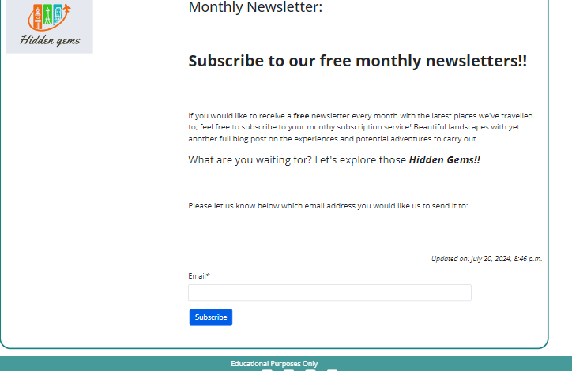

# Hidden Gems
Hidden Gems is a special infomative blog on hidden, underrated yet somewhat known locations which avid travelers may be keen to read up on, share with others or even travel to.  It offers users a monthly newsletter to stay updated on the latest discoveries, as well as the chance to collaborate.


The live link for "Hidden Gems" can be found [HERE](https://hidden-gem-blog-d08378ae9ea1.herokuapp.com/)

## Table of Contents
+ [UX](#ux "UX")
  + [Site Purpose](#site-purpose "Site Purpose")
  + [Site Goal](#site-goal "Site Goal")
  + [Audience](#audience "Audience")
  + [Communication](#communication "Communication")
  + [Existing User Goals](#existing-user-goals "Existing User Goals")
  + [New User Goals](#new-user-goals "New User Goals")
+ [User Stories](#user-stories "User Stories")
  + [Admin stories](#admin-stories "Admin stories")
  + [Site User stories](#site-user-stories "Site User stories")
+ [Design](#design "Design")
  + [Colour Scheme](#colour-scheme "Colour Scheme")
  + [Typography](#typography "Typography")
  + [Imagery](#imagery "Imagery")
+ [Features](#features "Features")
  + [Existing Features](#existing-features "Existing Features")
  + [C.R.U.D](#crud "C.R.U.D")
+ [Testing](#testing "Testing")
  + [Validator Testing](#validator-testing "Validator Testing")
  + [Unfixed Bugs](#unfixed-bugs "Unfixed Bugs")
+ [Technologies Used](#technologies-used "Technologies Used")
  + [Main Languages Used](#main-languages-used "Main Languages Used")
  + [Frameworks, Libraries & Programs Used](#frameworks-libraries-programs-used "Frameworks, Libraries & Programs Used")
+ [Deployment](#deployment "Deployment")
+ [Credits](#credits "Credits")
  + [Content](#content "Content")
  + [Media](#media "Media")

## UX

### Site Purpose:
The aim of ths site is to bring together people from various walks of life with pictures of wonderful locations around the world. [“Hidden Gems”](https://hidden-gem-blog-d08378ae9ea1.herokuapp.com/) is a blog with a variety of beautiful locations around the world which visitors to the site can look up and appreciate, some maybe even with the purpose of traveling to one of these based on the information provided.  Registered site users can sign up to a monthly newsletter with the latest locations posted.  They can also like posts and comment, giving them the possibility of interacting together based on their own experiences.

### Site Goal:
To create a community where various users can participate in sharing some of the most beautiful locations around the globe. We're also set on it being estalished as a top-quality comfort zone for travelers, whether traveling alone or as a family, so they can comfortably share and rely on experiences and tips given, such as the resources available.

### Audience:
Practically anybody with an interest in gorgeous landscapes since it makes for an excellent informative site on places to travel to and what to see.  Some may also be keen travelers who travel frequently.  Also, it's ideal for someone just seeking advice on what services to use abroad.

### Communication:
users are provided with user-friendly features to get in contact with site owner or other potential bloggers/users within the posts.

### Existing User Goals:
The capability of viewing, commenting on, and sharing experiences constantly within the community of travelers registered. Also, the potential to create collaborations to either facilitate a trip or support in other ways.

### New User Goals:
To feel welcomed by several posts on beautiful imagery and scenery to be discovered throughout the website.

### Future Goals:
- To provide users with a GPS location of the location and it's proximite surroundings that can be taken advantage of.
- Users and admin on the posts would be able to optionally provide specific recommendations in terms of hotel accomodations, or have the site provide default options based on the GPS location's proximity.
- The option for other bloggers to create their own posts to be approved and shared among the community as opposed to just the site admin's travels & posts.
- The ability to send out the monthly newsletter to subscribed user's emails with the newest experiences and possibly a contest with the chance to win a prize or souvenir.
- A structure within the website to help users plan their flights and have a rough estimate of a necessary budget, which could eventually lead to a flight-purchasing website such as skyscanner. 

## User Stories
Not all stories have been implemented. Some have been left for future implementations as the site grows and expands.

### Admin stories:
#### As an admin:
1. I can **create, read, update and delete posts** so that **I can manage my blog content**.
 - Story points: 4
2. I can **enter the subscription section** so that **I can see a list of subscribed emails**.
 - Story points: 2
3. I can **create and update the About page content** so that **it is available to view on the site.**.
 - Story points: 1
4. I can **create draft posts** so that **I can finish writing the content later.**.
 - Story points: 2
5. I can **approve or disapprove comments** so that **I can filter out objectionable comments.**.
 - Story points: 2
6. I can **store collaboration requests** so that **I can read submitted forms.**.
 - Story points: 2

### Site User stories:
#### As a site user:
1. I can **leave comments on a post** so that **I can be involved in the conversation.**.
 - Story points: 3
2. I can **click on the Travel Resources section** so that **I can view the information provided**.
 - Story points: 1
3. I can **modify or delete my comment on a post** so that **I can be involved in the conversation**.
 - Story points: 2
4. I can **post a message to the Site Admin with my details** so that **I can propose an idea for collaboration.**.
 - Story points: 2
5. I can **register an account** so that **I can comment on a post.**.
 - Story points: 3
6. I can **view comments on an individual post** so that **I can read the conversation.**.
 - Story points: 2
7. I can **can click on the about link** so that **I can read information about the site and site admin.**.
 - Story points: 1
8. I can **click on a post** so that **I can read the full text.**.
 - Story points: 1
9. I can **view a paginated list of posts** so that **I can select which post I want to view.**.
 - Story points: 3
10. I can **enter my email** so that **I am subscribed to the newsletter service.**.
 - Story points: 3
11. I can **update my email** so that **I am subscribed to the newsletter service with the correct email address.**.
 - Story points: 4
12. I can **delete my email** so that **I am unsubscribed to the newsletter service.**.
 - Story points: 4

## Design

### Wireframes:

#### Home Page: 


#### Post Details Page:


#### About Page:


#### Resources Page:


#### Newsletter Page:


### Database Schema

########


### Colour Scheme:


- #fff - is typically used as my background colour and also text colour in the case of there being a dark-coloured background.
- #212529 - is the text colour used throughout the webpage when there is a light-coloured background.
- #188181 - to resemble some familiarity with the blue colour within the logo, a different shade was actually used to help with the colour contrast issues.
- #F06814 - to resemble the orange colour within the logo and give a more familiar feeling throughout the webpage.
- #445261 - is used in the mastheads within the post details html pages to contrast the image colours.

### Typography:
All fonts were obtained from the Google Fonts library. I chose the following fonts for the page:
1. Poppins: used for titles and Navbar elements such as the nav-items and text-muted phrase.
2. Open Sans: Typically used for the body text of the webpage.

### Imagery:
- All images have been named in the credit section, most of which are photos of places, whereas the others related to travel are from free photo sites.

## Features

### Existing Features:

#### Home Page:


#### Navigation Bar:

##### Desktop:


##### Mobile:


#### Paginated features:
- Leads user to next/ previous page(s) assuming there's more posts than the page's limit.


#### About Page:


#### Collaboration Form on About Page:


#### Travel Resources Page:


#### Post Details Page:


#### Like button feature:


#### Post Details Comment Section:


#### Log in, Log out & Sign up:

##### Login:


##### Logout:


##### Sign-up:


#### Footer:


### C.R.U.D:

#### Newsletter Subscription Page - Create:
- This gives users the option to sign up for the newsletter by entering their email before being alerted on the success of their subsription.
- It is only visible to users who are signed in.


#### Newsletter Subscription Page - Read:
- User is alerted as to the successful subsription...

- ...before being led to the email-list page with a display of the email(s) they have subscribed on their account alone.


#### Newsletter Subscription Page - Update:
- The user is given the option to edit the email address on their account alone.


#### Newsletter Subscription Page - Delete:
- The user is given the option to delete an email(s) and unscubscribe on their account alone.


### Features Left to Implement
- System to send out newsletters.
- newsletter contests.
- flight reservation section.
- GPS map showing location.
- Hotels/ Other accomodation around the location using GPS.
- Password reset.
- Social media sign-in.

## Testing

### Validator Testing
| **TEST** | **ACTION** | **EXPECTATION** | **RESULT** |
| ----------------------------- | ----------------------- | --------------------------- | ---------- |
| gems - settings.py | PEP8 validator | [No issues found](static/images-readme/pep8-validator-python.png) | ✅ |
| gems - urls.py | PEP8 validator | No issues found | ✅ |
| blog app - forms.py | PEP8 validator | No issues found | ✅ |
| blog app - models.py | PEP8 validator | No issues found | ✅ |
| blog app - views.py | PEP8 validator | No issues found | ✅ |
| blog app - urls.py | PEP8 validator | No issues found | ✅ |
| blog app - admin.py | PEP8 validator | No issues found | ✅ |
| about app - forms.py | PEP8 validator | No issues found | ✅ |
| about app - models.py | PEP8 validator | No issues found | ✅ |
| about app - views.py | PEP8 validator | No issues found | ✅ |
| about app - urls.py | PEP8 validator | No issues found | ✅ |
| about app - admin.py | PEP8 validator | No issues found | ✅ |
| newsletter app - forms.py | PEP8 validator | No issues found | ✅ |
| newsletter app - models.py | PEP8 validator | No issues found | ✅ |
| newsletter app - views.py | PEP8 validator | No issues found | ✅ |
| newsletter app - urls.py | PEP8 validator | No issues found | ✅ |
| newsletter app - admin.py | PEP8 validator | No issues found | ✅ |
| resources app - forms.py | PEP8 validator | No issues found | ✅ |
| resources app - models.py | PEP8 validator | No issues found | ✅ |
| resources app - views.py | PEP8 validator | No issues found | ✅ |
| resources app - urls.py | PEP8 validator | No issues found | ✅ |
| resources app - admin.py | PEP8 validator | No issues found | ✅ |
| style.css | [W3C - Jigsaw](https://jigsaw.w3.org/css-validator/) validator | [No issues found](static/images-readme/w3c-validator-css.png) | ✅ |
| Home page - html | [W3C](https://validator.w3.org/) validator - source code | [No issues found](static/images-readme/w3c-validator-html.png) | ✅ |
| About page - html | W3C validator - source code | No issues found | ✅ |
| Post Details page - html | W3C validator - source code | No issues found | ✅ |
| Resources page - html | W3C validator - source code | No issues found | ✅ |
| Newsletter page - html | W3C validator - source code | No issues found | ✅ |
| Sign-in page - html | W3C validator - source code | No issues found | ✅ |
| Home page - html | lighthouse | [Acceptable scores](static/images-readme/lighthouse.png) | ✅ |
| About page - html | lighthouse | Acceptable scores | ✅ |
| Post-Details page - html | lighthouse | Acceptable scores | ✅ |
| Resources page - html | lighthouse | Acceptable scores | ✅ |
| Newsletter page - html | lighthouse | Acceptable scores | ✅ |
| Sign-in page - html | lighthouse | Acceptable scores | ✅ |
| WAVE results | WAVE | [Acceptable scores](static/images-readme/wave.png) | ✅ |
| Microsoft Edge browser | Launch site | Site opens without issue | ✅ |
| Google Chrome browser | Launch site | Site opens without issue | ✅ |

### Responsiveness testing

| **TEST**                      | **ACTION**              | **EXPECTATION**             | **RESULT** |
| ----------------------------- | ----------------------- | --------------------------- | ---------- |
| Home page - responsiveness    | Size site down to 320px | all elements stay on screen | ✅         |
| Home page - responsiveness    | Size site up to 1920px  | all elements stay on screen | ✅         |
| About page - responsiveness   | Size site down to 320px | all elements stay on screen | ✅         |
| About page - responsiveness   | Size site up to 1920px  | all elements stay on screen | ✅         |
| Post-Details page - responsiveness  | Size site down to 320px | all elements stay on screen | ✅         |
| Post-Details page - responsiveness  | Size site up to 1920px  | all elements stay on screen | ✅         |
| Resources page - responsiveness    | Size site down to 320px | all elements stay on screen | ✅         |
| Resources page - responsiveness    | Size site up to 1920px  | all elements stay on screen | ✅         |
| Newsletter page - responsiveness   | Size site up to 1920px  | all elements stay on screen | ✅         |
| Newsletter page - responsiveness   | Size site up to 1920px  | all elements stay on screen | ✅         |
| Sign-in page - responsiveness | Size site down to 320px | all elements stay on screen | ✅         |
| Sign-in page - responsiveness | Size site up to 1920px  | all elements stay on screen | ✅         |

### C.R.U.D. testing

| **TEST**          | **ACTION**             | **EXPECTATION**          | **RESULT** |
| ----------------- | ---------------------- | ------------------------ | ---------- |
| Newsletter subscription - Create     | Add new instance to DB | Instance created         | ✅         |
| Newsletter subscription - Read       | Retrieve all instances | Instances visible in UI  | ✅         |
| Newsletter subscription - Update     | Modify an instance     | Mods saved & visible     | ✅         |
| Newsletter subscription - Delete     | Delete an instance     | Instance removed from UI | ✅         |
| Comments - Create | Add new instance to DB | Instance created         | ✅         |
| Comments - Read   | Retrieve all instances | Instances visible in UI  | ✅         |
| Comments - Update | Add new instance to DB | Mods saved & visible     | ✅         |
| Comments - Delete   | Retrieve all instances | Instance removed from UI | ✅         |
| Like - Create | Add new instance to DB | Instance created         | ✅         |
| Like - Delete | Delete an instance     | Instance removed from UI | ✅         |

### FEATURES

| **TEST**                      | **ACTION**             | **EXPECTATION**                                           | **RESULT** |
| ----------------------------- | ---------------------- | --------------------------------------------------------- | ---------- |
| Navigation bar                | Click on nav link      | user routed to correct page                               | ✅         |
| Footer links                  | Click on footer links  | user routed to new browser tab                            | ✅         |
| Like button                   | Click "like"           | Post liked/unliked accordingly                            | ✅         |
| Comment section                   | Written empty message           | does not submit, prompts to write a message                            | ✅         |
| Comment section                   | Write message and submit           | user informed on pending approval                            | ✅         |
| Edit button                   | Click edit button      | user allowed to edit comment only if previously approved                             | ✅         |
| Delete button                 | Click delete button    | user allowed to delete comment only if previously approved                                | ✅         |
| Collaboration form                | Submit form    | user alerted on successful form                                | ✅         |
| External links in Resources                | Click link             | User routed to appropriate webpage                           | ✅         |
| Subscription                | enter invalid email             | User prompted to write a valid email                           | ✅         |
| Subscription CRUD buttons                | Click buttons            | User routed to appropriate page and UI updated                    | ✅         |
| Login                         | User logs in           | UI updates & user is logged in                            | ✅         |
| Sign up                       | User signs up          | new account created for the user                          | ✅         |
| Logout                        | User clicks logout     | UI updates, user is logged out, user cannot create a post | ✅         |

### BUG TESTING:
1. Heroku logs--tail error when deploying to Heroku:
 - Added correctly-written web: gunicorn gems.wsgi to ProcFile to link it correctly.

2. 'unexpected chunk number 1 (expected 0)' error:
 - This was caused be corrupted Data upon using loaddata with json.file according to Tutor Support.
 - Uncommented sqlite database and commented out external database to temporarily work on project before eventually providing a solution (mentioned in bug #3)

3. Opening new external Database:
 - Did pip install and pip freeze with all requirements, created env.py file, added new DB URL and secret key, collectstatic, updated CSRF, did makemigrations and migrate command and yet page would not load correctly.
 - The cloudinary URL was missing within the env.py, this allowed the page to load correctly.

4. CSS styles would not load:
 - Upon using terminal command to copy staticfiles into a template folder, accidently created and nested everything within an additional templates folder so url path did not connect.
 - Moved everything out to the correct template folder and css styles were loading correctly.

5. Admin interface content lacked RichText Editor for content fields in resources app:
 - summernote_fields was not correctly linked to content containers within the admin.py file.

6. Likes generated an error:
 - within the blog's models.py the model's related name for the like button clashed with the comment section, I changed the name so code could correctly distinguish model and this fixed the bug.

7. Validator error message <o:p>:
 - This was due to my population of the content fields having used my microsoft word to draft the tet before adding them to the admin interface, could not be seen in my code.
 - Manually accessed and edited code from Admin interface and deleted the tags.

8. Page would break when screen size was below 768px and only provide images:
 - Deleted 'flex: no-wrap' to fix this issue and correctly display text with the images so users can access post details for each post.

9. Editing a comment while awaiting approval:
 - Page would crash is user were to click on the edit button before comment had been approved.
 - Fixed the issue by removing the edit button for comments awaiting approval.

10. Navbar overflow:
 - Navbar displayed overflow off page between 1150px and 990px on all pages.
 - Reduced the logo size, nav-link size and text-muted size so elements would not cause navbar to overflow before collapsing as media response styles take effect.

11. Like button with a reverse path error:
 - Upon correcting some of the hyphens and underscores, the blog's urls.py path had the correct pattern, but the views.py file still had **'post-detail'** instead of **post_detail** within the reverse function call.

### Unfixed Bugs
1. Sign up form - HTML Validator errors:
- Upon validating, I noticed [4 errors with tags](static/images-readme/signup-html-errors.png) which were nowhere to be found within my code.
- With help from Tutor Support, we determined this was from Django's Allauth's error and that I could do nothing to fix it from my end.

## Technologies Used
### Main Languages Used
- HTML5
- CSS3
- Javascript
- Python
- Django
- SQL - Postgres

### Frameworks, Libraries & Programs Used
- [Google Fonts](https://fonts.google.com/) - for the font families: 
- [Font Awesome](fontawesome.com) - for the social network icons.
- [GitPod](https://www.gitpod.io/) - for creating html files, css stylesheet and python files.
- [GitHub](https://github.com/) - to store my repository for submission.
- Google Dev tools - to test and fix issues detected.
- [Pexels](https://www.pexels.com/) to use free images for site.
- [Free Pik](https://www.freepik.es/) to use free images for site.
- [Balsamiq](https://balsamiq.com/) - for the wireframe mockups of my webpage.
- [Am I Responsive?](https://ui.dev/amiresponsive) - to ensure the webpage displayed well on all devices.
- [Tiny PNG](https://tinypng.com/) to compress images.
- [DrawSQL](https://drawsql.app/) - for ERD mockups
- [FreeLogoDesign](https://app.freelogodesign.org/)
- [Colormind.io](http://colormind.io/) to generate color palette used. 
- Django
- Bootstrap

### Installed Packages:
- asgiref==3.8.1
- cloudinary==1.36.0
- crispy-bootstrap5==0.7
- dj-database-url==0.5.0
- dj3-cloudinary-storage==0.0.6
- Django==5.0.7
- django-allauth==0.57.2
- django-crispy-forms==2.2
- django-summernote==0.8.20.0
- gunicorn==20.1.0
- oauthlib==3.2.2
- psycopg2==2.9.9
- PyJWT==2.8.0
- python3-openid==3.2.0
- requests-oauthlib==2.0.0
- sqlparse==0.5.0
- urllib3==1.26.19
- whitenoise==5.3.0

## Deployment
The site was deployed to Heroku. The steps to deploy are as follows:
- Install Django & Gunicorn:
```pip3 install 'django<4' gunicorn```
- Install Django database & psycopg:
```pip3 install dj_database_url psycopg2```
- Install Cloudinary:
```pip3 install dj3-cloudinary-storage```
- Creating the requirements.txt file with the following command:
```pip3 freeze --local > requirements.txt```
- a django project was created using:
```django-admin startproject printstatements .```
- the blog app was then created with:
```python3 manage.py startapp blog```
- which was then added to the settings.py file within our project directory.
- the changes were then migrated using:
```python3 manage.py migrate```
- navigated to [Heroku](www.heroku.com) & created a new app called print-statements.
- added the Heroku Postgres database to the Resources tab.
- navigated to the Settings Tab, to add the following key/value pairs to the configvars:
1. key: SECRET_KEY | value: randomkey
2. key: PORT | value: 8000
3. key: CLOUDINARY_URL | value: API environment variable
4. key: DATABASE_URL | value: value supplied by Heroku
- added the DATABASE_URL, SECRET_KEY & CLOUDINARY_URL to the env.py file
- added the DATABASE_URL, SECRET_KEY & CLOUDINARY_URL to the settings.py file
- add an import os statement for the env.py file.
- added Heroku to the ALLOWED_HOSTS in settings.py
- created the Procfile
- pushed the project to Github
- connected my github account to Heroku through the Deploy tab
- connected my github project repository, and then clicked on the "Deploy" button

* Due to Heroku revoking their frie tier access, the project has been redeployed using (Render)[https://render.com/] & (ElephantSQL)[https://www.elephantsql.com/] using the following [instructions](https://code-institute-students.github.io/deployment-docs/30-pp4/)
- The live link for "print(STATEMENTS)" can be found [HERE](https://project4-print-statements.onrender.com/)

## Credits

### Content
- [Mats Simonsson](https://github.com/Pelikantapeten): A fellow student & friend who consistently helps me to troubleshoot when needed, support me constantly, and be my rubber duck.
- [Martina Terlevic](https://github.com/SephTheOverwitch): A constant support system, providing reassurance, and the ability to calm me down.
- “I think therefore I blog” walkthrough: Provided the initial steps for setting up & deploying the site, as well as this, I also used the instructions they provided in order to implement a django blog into my app, following the walkthrough once again step-by-step. This also includes some formatting for the way each blog post is displayed on the blog page. Credits have been added as comments where code was used.
- "I think therefore I blog" + "Hello Django" + Slack + Stackoverflow + a fellow [student](https://github.com/cornishcoder1): aided in the creation of the CRUD functions.
- Sean from Tutor Support: Singling out the most recent blog post with an "IF statement".
- Ger from Tutor support: assistance deciphering an error I could not understand. Re-linking the Heroku database in the env.py file with the new value resolved this.
- Ger from Tutor support: limiting view sections to a single user.
- ['Simple is Better Than Complex'](https://simpleisbetterthancomplex.com/tutorial/2018/01/18/how-to-implement-multiple-user-types-with-django.html): creating types of user groups.
- [Bootstrap](https://getbootstrap.com/docs/5.2/components/dropdowns/): dropdown nav menu.
- [Stackoverflow](https://stackoverflow.com/questions/66185424/django-how-do-i-handle-urls-with-multiple-apps): connect URL paths from multiple apps.
- [Stackoverflow](https://stackoverflow.com/questions/38724012/django-crispy-forms-set-label-text-for-multiple-fields): add form label.
- [Stackoverflow](https://stackoverflow.com/questions/3111779/how-can-i-get-the-file-name-from-request-files): iterating over form field.
- [Stackoverflow](https://stackoverflow.com/questions/23956288/django-all-auth-email-required): Allauth email sign up required.
- [Slack thread](https://code-institute-room.slack.com/archives/C7EJUQT2N/p1642336796215800?thread_ts=1642316166.200400&cid=C7EJUQT2N): Assistance with function to submit new prints.
- [Ordinary Coders](https://ordinarycoders.com/blog/article/django-messages-framework): implementing bootstrap messages in django.
- "Hello Django": The two tests implemented in this project were reused from the walkthrough project.

### Media
- All photography displayed in the Artists gallery was created by me.
- The drawings were provided by my friend, [Eleni Sarri](https://www.instagram.com/elenibydesign/), with her permission.

#### Pexels:
<!-- - unused, Photo by [Barbara Wyrowińska](https://www.pexels.com/photo/green-photo-frame-2961734/) -->
- Hero image, Photo by: [Tom Balabaud](https://www.pexels.com/photo/framed-photo-lot-1579708/)
- About page, Photo by: [¶Project Atlas](https://www.pexels.com/photo/three-paintings-hanging-in-gallery-1674049/)
- Default blog post image, by: [cottonbro](https://www.pexels.com/photo/person-holding-white-and-black-frame-4065183/)